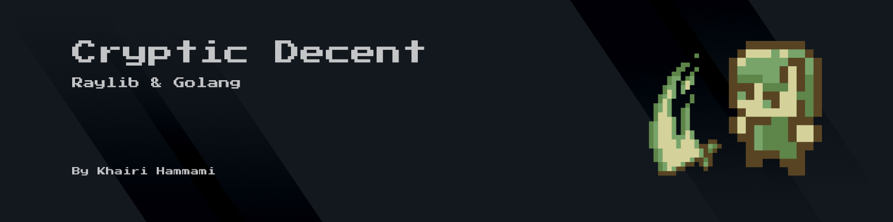

Cryptic Descent is a 2D dungeon crawler prototype developed in **Go** using the **Raylib** C library. It's a fully custom engine built as a personal milestone to explore procedural generation, performance-first rendering, and low-level engine architecture without relying on heavyweight game engines like Unity (fu).

> ⚠️ This is **not a polished or commercial game**. It's a technical playground built to learn, optimize, and push boundaries in engine programming and procedural design.


## Core Gameplay Concept
The player is dropped into a procedurally generated dungeon where the main objective is simple: collect all scattered keys to escape. But if you delay or fail to collect them in time, the map doesn't wait for you, **it reshuffles itself into a brand-new layout**.

Each regeneration introduces:
* A new dungeon layout built via BSP + randomized corridors
* New enemy placements and loot
* A different pathing challenge with no memory to rely on

You'll encounter and fight various enemies like; Spiders, Skeletons, Goblins and more...
each with their own AI state machine and behavior

Along the way you'll collect buffs, dodge traps, cure poisons, and scavenge for healing items — all while the map and threats evolve around you.

It's not a puzzle. It's not a shooter. It's a dungeon that resets itself against you if you slack.

## Key Technical Features

### 🧱 Modular Architecture
- Multi-state screen manager (Title, Gameplay, Pause, Outro)
- Smooth camera system with zoom and tracking
- Debug overlay and FPS monitor

### 🗺️ Procedural World Generation
- Binary Space Partitioning (BSP) for dungeon layout
- Kruskal's Algorithm & Union-Find for optimal pathing
- Natural corridors via Bezier curves
- Weighted room sizes and contextual prop placement

### 💡 Advanced Lighting Engine
- Dynamic lights: static, flicker, shimmer, pulsing
- Shader-based ambient lighting and contextual falloff
- Lighting attached to particles (fire, explosions, etc.)
- Context aware lightning

### 🧠 Enemy & Combat
- A* Pathfinding with path smoothing
- Collision-based melee combat with visual feedback
- Power-ups, buffs, and pickup animations

### ⚙️ Performance Optimizations
- Texture batching and sprite sorting
- Quadtree view frustum culling
- Dynamic asset loading & object pooling
- Separate low-res texture minimap with dirty tracking


## Screenshots


## Run It Locally

### Prerequisites
- Go 1.20+ installed
- Raylib installed and configured

### Clone and Build

```bash
git clone https://github.com/hammamikhairi/Cryptic-descent
cd cryptic-descent
go run main.go
```

### Or Build
```bash
git clone https://github.com/hammamikhairi/Cryptic-descent
go build -o cryptic-descent .
./cryptic-descent
```
Note: You'l need to have Raylib C libraries installed and accessible for your build environment.

## Lessons Learned
- How to implement and tune a real-time lighting system with performance in mind
- Procedural dungeon generation using graph theory and geometry
- Raylib's potential when paired with a modern language like Go
- What engines abstract away—and why that matters sometimes


## License
MIT - use it, fork it, learn from it. If you ship something cool using any piece of this, I’d love to know.